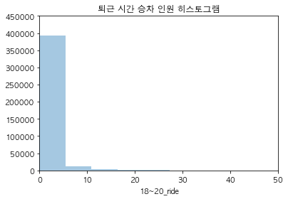
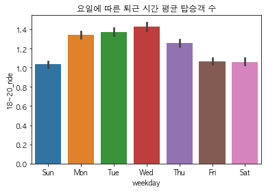
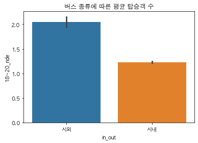
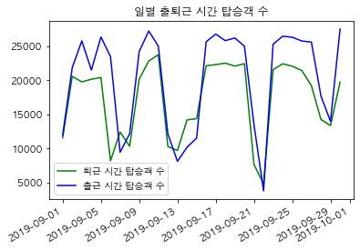

```python
# from google.colab import drive
# drive.mount('./mount')
```


```python
import pandas as pd

train = pd.read_csv('data/train.csv')
test = pd.read_csv('data/test.csv')
bts = pd.read_csv('data/bus_bts.csv')
jeju_life = pd.read_csv('data/jeju_financial_life_data.csv')
weather = pd.read_csv('data/weather.csv', encoding='cp949')
rain = pd.read_csv('data/rain.csv', encoding='utf-8')
```


```python
train.head()
```


<div>
<style scoped>
    .dataframe tbody tr th:only-of-type {
        vertical-align: middle;
    }

    .dataframe tbody tr th {
        vertical-align: top;
    }

    .dataframe thead th {
        text-align: right;
    }
</style>
<table border="1" class="dataframe">
  <thead>
    <tr style="text-align: right;">
      <th></th>
      <th>id</th>
      <th>date</th>
      <th>bus_route_id</th>
      <th>in_out</th>
      <th>station_code</th>
      <th>station_name</th>
      <th>latitude</th>
      <th>longitude</th>
      <th>6~7_ride</th>
      <th>7~8_ride</th>
      <th>...</th>
      <th>9~10_ride</th>
      <th>10~11_ride</th>
      <th>11~12_ride</th>
      <th>6~7_takeoff</th>
      <th>7~8_takeoff</th>
      <th>8~9_takeoff</th>
      <th>9~10_takeoff</th>
      <th>10~11_takeoff</th>
      <th>11~12_takeoff</th>
      <th>18~20_ride</th>
    </tr>
  </thead>
  <tbody>
    <tr>
      <th>0</th>
      <td>0</td>
      <td>2019-09-01</td>
      <td>4270000</td>
      <td>시외</td>
      <td>344</td>
      <td>제주썬호텔</td>
      <td>33.48990</td>
      <td>126.49373</td>
      <td>0.0</td>
      <td>1.0</td>
      <td>...</td>
      <td>5.0</td>
      <td>2.0</td>
      <td>6.0</td>
      <td>0.0</td>
      <td>0.0</td>
      <td>0.0</td>
      <td>0.0</td>
      <td>0.0</td>
      <td>0.0</td>
      <td>0.0</td>
    </tr>
    <tr>
      <th>1</th>
      <td>1</td>
      <td>2019-09-01</td>
      <td>4270000</td>
      <td>시외</td>
      <td>357</td>
      <td>한라병원</td>
      <td>33.48944</td>
      <td>126.48508</td>
      <td>1.0</td>
      <td>4.0</td>
      <td>...</td>
      <td>2.0</td>
      <td>5.0</td>
      <td>6.0</td>
      <td>0.0</td>
      <td>0.0</td>
      <td>0.0</td>
      <td>0.0</td>
      <td>0.0</td>
      <td>0.0</td>
      <td>5.0</td>
    </tr>
    <tr>
      <th>2</th>
      <td>2</td>
      <td>2019-09-01</td>
      <td>4270000</td>
      <td>시외</td>
      <td>432</td>
      <td>정존마을</td>
      <td>33.48181</td>
      <td>126.47352</td>
      <td>1.0</td>
      <td>1.0</td>
      <td>...</td>
      <td>2.0</td>
      <td>0.0</td>
      <td>0.0</td>
      <td>0.0</td>
      <td>0.0</td>
      <td>0.0</td>
      <td>0.0</td>
      <td>0.0</td>
      <td>0.0</td>
      <td>2.0</td>
    </tr>
    <tr>
      <th>3</th>
      <td>3</td>
      <td>2019-09-01</td>
      <td>4270000</td>
      <td>시내</td>
      <td>1579</td>
      <td>제주국제공항(600번)</td>
      <td>33.50577</td>
      <td>126.49252</td>
      <td>0.0</td>
      <td>17.0</td>
      <td>...</td>
      <td>26.0</td>
      <td>14.0</td>
      <td>16.0</td>
      <td>0.0</td>
      <td>0.0</td>
      <td>0.0</td>
      <td>0.0</td>
      <td>0.0</td>
      <td>0.0</td>
      <td>53.0</td>
    </tr>
    <tr>
      <th>4</th>
      <td>4</td>
      <td>2019-09-01</td>
      <td>4270000</td>
      <td>시내</td>
      <td>1646</td>
      <td>중문관광단지입구</td>
      <td>33.25579</td>
      <td>126.41260</td>
      <td>0.0</td>
      <td>0.0</td>
      <td>...</td>
      <td>0.0</td>
      <td>0.0</td>
      <td>0.0</td>
      <td>0.0</td>
      <td>0.0</td>
      <td>0.0</td>
      <td>1.0</td>
      <td>0.0</td>
      <td>0.0</td>
      <td>0.0</td>
    </tr>
  </tbody>
</table>
<p>5 rows × 21 columns</p>
</div>


```python
train.info()
```

    <class 'pandas.core.frame.DataFrame'>
    RangeIndex: 415423 entries, 0 to 415422
    Data columns (total 21 columns):
     #   Column         Non-Null Count   Dtype  
    ---  ------         --------------   -----  
     0   id             415423 non-null  int64  
     1   date           415423 non-null  object 
     2   bus_route_id   415423 non-null  int64  
     3   in_out         415423 non-null  object 
     4   station_code   415423 non-null  int64  
     5   station_name   415423 non-null  object 
     6   latitude       415423 non-null  float64
     7   longitude      415423 non-null  float64
     8   6~7_ride       415423 non-null  float64
     9   7~8_ride       415423 non-null  float64
     10  8~9_ride       415423 non-null  float64
     11  9~10_ride      415423 non-null  float64
     12  10~11_ride     415423 non-null  float64
     13  11~12_ride     415423 non-null  float64
     14  6~7_takeoff    415423 non-null  float64
     15  7~8_takeoff    415423 non-null  float64
     16  8~9_takeoff    415423 non-null  float64
     17  9~10_takeoff   415423 non-null  float64
     18  10~11_takeoff  415423 non-null  float64
     19  11~12_takeoff  415423 non-null  float64
     20  18~20_ride     415423 non-null  float64
    dtypes: float64(15), int64(3), object(3)
    memory usage: 66.6+ MB


```python
bts.head()
```


<div>
<style scoped>
    .dataframe tbody tr th:only-of-type {
        vertical-align: middle;
    }

    .dataframe tbody tr th {
        vertical-align: top;
    }

    .dataframe thead th {
        text-align: right;
    }
</style>
<table border="1" class="dataframe">
  <thead>
    <tr style="text-align: right;">
      <th></th>
      <th>user_card_id</th>
      <th>bus_route_id</th>
      <th>vhc_id</th>
      <th>geton_date</th>
      <th>geton_time</th>
      <th>geton_station_code</th>
      <th>geton_station_name</th>
      <th>getoff_date</th>
      <th>getoff_time</th>
      <th>getoff_station_code</th>
      <th>getoff_station_name</th>
      <th>user_category</th>
      <th>user_count</th>
    </tr>
  </thead>
  <tbody>
    <tr>
      <th>0</th>
      <td>1.010010e+15</td>
      <td>23000000</td>
      <td>149793674</td>
      <td>2019-09-10</td>
      <td>06:34:45</td>
      <td>360</td>
      <td>노형오거리</td>
      <td>2019-09-10</td>
      <td>07:10:31</td>
      <td>592.0</td>
      <td>화북초등학교</td>
      <td>1</td>
      <td>1</td>
    </tr>
    <tr>
      <th>1</th>
      <td>1.010010e+15</td>
      <td>23000000</td>
      <td>149793674</td>
      <td>2019-09-10</td>
      <td>06:34:58</td>
      <td>360</td>
      <td>노형오거리</td>
      <td>2019-09-10</td>
      <td>06:56:27</td>
      <td>3273.0</td>
      <td>고산동산(광양방면)</td>
      <td>1</td>
      <td>1</td>
    </tr>
    <tr>
      <th>2</th>
      <td>1.019160e+15</td>
      <td>21420000</td>
      <td>149793535</td>
      <td>2019-09-10</td>
      <td>07:19:07</td>
      <td>2495</td>
      <td>동광환승정류장4(제주방면)</td>
      <td>2019-09-10</td>
      <td>07:40:29</td>
      <td>431.0</td>
      <td>정존마을</td>
      <td>4</td>
      <td>1</td>
    </tr>
    <tr>
      <th>3</th>
      <td>1.019150e+15</td>
      <td>21420000</td>
      <td>149793512</td>
      <td>2019-09-09</td>
      <td>09:14:47</td>
      <td>3282</td>
      <td>대정환승정류장(대정읍사무소)</td>
      <td>2019-09-09</td>
      <td>10:02:46</td>
      <td>431.0</td>
      <td>정존마을</td>
      <td>1</td>
      <td>1</td>
    </tr>
    <tr>
      <th>4</th>
      <td>1.010010e+15</td>
      <td>21420000</td>
      <td>149793512</td>
      <td>2019-09-09</td>
      <td>09:28:53</td>
      <td>2820</td>
      <td>삼정지에듀</td>
      <td>2019-09-09</td>
      <td>10:21:37</td>
      <td>2972.0</td>
      <td>제주국제공항(종점)</td>
      <td>4</td>
      <td>1</td>
    </tr>
  </tbody>
</table>
</div>


```python
bts.info(null_counts=True)
```

    /Users/charles/Documents/GitHub/busRidersPredic/venv/lib/python3.7/site-packages/ipykernel_launcher.py:1: FutureWarning: null_counts is deprecated. Use show_counts instead
      """Entry point for launching an IPython kernel.


    <class 'pandas.core.frame.DataFrame'>
    RangeIndex: 2409414 entries, 0 to 2409413
    Data columns (total 13 columns):
     #   Column               Non-Null Count    Dtype  
    ---  ------               --------------    -----  
     0   user_card_id         2409414 non-null  float64
     1   bus_route_id         2409414 non-null  int64  
     2   vhc_id               2409414 non-null  int64  
     3   geton_date           2409414 non-null  object 
     4   geton_time           2409414 non-null  object 
     5   geton_station_code   2409414 non-null  int64  
     6   geton_station_name   2409365 non-null  object 
     7   getoff_date          1513678 non-null  object 
     8   getoff_time          1513678 non-null  object 
     9   getoff_station_code  1513678 non-null  float64
     10  getoff_station_name  1513639 non-null  object 
     11  user_category        2409414 non-null  int64  
     12  user_count           2409414 non-null  int64  
    dtypes: float64(2), int64(5), object(6)
    memory usage: 239.0+ MB


```python
pd.options.display.max_info_columns
```


    100


```python
pd.options.display.max_info_rows
```


    1690785


```python
jeju_life.head()
```


<div>
<style scoped>
    .dataframe tbody tr th:only-of-type {
        vertical-align: middle;
    }

    .dataframe tbody tr th {
        vertical-align: top;
    }

    .dataframe thead th {
        text-align: right;
    }
</style>
<table border="1" class="dataframe">
  <thead>
    <tr style="text-align: right;">
      <th></th>
      <th>zip_cd</th>
      <th>year_month</th>
      <th>x_axis</th>
      <th>y_axis</th>
      <th>sex</th>
      <th>age</th>
      <th>job_majorc</th>
      <th>job_smallc</th>
      <th>job_public</th>
      <th>job_profession</th>
      <th>...</th>
      <th>avg_debt</th>
      <th>avg_debt_credit</th>
      <th>avg_debt_noneb</th>
      <th>avg_debt_mortgage</th>
      <th>avg_debt_deposit</th>
      <th>avg_debt_collateral</th>
      <th>avg_credit_rat</th>
      <th>medium_resid_rat</th>
      <th>large_resid_rat</th>
      <th>vehicle_own_rat</th>
    </tr>
  </thead>
  <tbody>
    <tr>
      <th>0</th>
      <td>63299</td>
      <td>201902</td>
      <td>126.565889</td>
      <td>33.513210</td>
      <td>1</td>
      <td>54</td>
      <td>0.0</td>
      <td>0.166667</td>
      <td>0.000000</td>
      <td>0.000000</td>
      <td>...</td>
      <td>24285196</td>
      <td>11419148</td>
      <td>8863595</td>
      <td>55550000</td>
      <td>0</td>
      <td>55550000</td>
      <td>5</td>
      <td>-999999.0</td>
      <td>-999999.0</td>
      <td>0.000000</td>
    </tr>
    <tr>
      <th>1</th>
      <td>63560</td>
      <td>201902</td>
      <td>126.497121</td>
      <td>33.247225</td>
      <td>1</td>
      <td>59</td>
      <td>0.0</td>
      <td>0.125000</td>
      <td>0.000000</td>
      <td>0.000000</td>
      <td>...</td>
      <td>108571077</td>
      <td>25896955</td>
      <td>13317443</td>
      <td>0</td>
      <td>200000000</td>
      <td>74421721</td>
      <td>4</td>
      <td>-999999.0</td>
      <td>-999999.0</td>
      <td>0.000000</td>
    </tr>
    <tr>
      <th>2</th>
      <td>63560</td>
      <td>201902</td>
      <td>126.497121</td>
      <td>33.247225</td>
      <td>2</td>
      <td>49</td>
      <td>0.0</td>
      <td>0.250000</td>
      <td>0.000000</td>
      <td>0.000000</td>
      <td>...</td>
      <td>26424335</td>
      <td>12015311</td>
      <td>12015311</td>
      <td>40833359</td>
      <td>0</td>
      <td>40833359</td>
      <td>2</td>
      <td>-999999.0</td>
      <td>-999999.0</td>
      <td>0.000000</td>
    </tr>
    <tr>
      <th>3</th>
      <td>63560</td>
      <td>201902</td>
      <td>126.497121</td>
      <td>33.247225</td>
      <td>1</td>
      <td>54</td>
      <td>0.0</td>
      <td>0.181818</td>
      <td>0.090909</td>
      <td>0.090909</td>
      <td>...</td>
      <td>647716901</td>
      <td>39952556</td>
      <td>21558153</td>
      <td>36697792</td>
      <td>0</td>
      <td>706300496</td>
      <td>4</td>
      <td>-999999.0</td>
      <td>-999999.0</td>
      <td>0.166667</td>
    </tr>
    <tr>
      <th>4</th>
      <td>63560</td>
      <td>201902</td>
      <td>126.497121</td>
      <td>33.247225</td>
      <td>1</td>
      <td>49</td>
      <td>0.0</td>
      <td>0.250000</td>
      <td>0.000000</td>
      <td>0.000000</td>
      <td>...</td>
      <td>248232725</td>
      <td>35712501</td>
      <td>5568751</td>
      <td>0</td>
      <td>0</td>
      <td>626810674</td>
      <td>5</td>
      <td>-999999.0</td>
      <td>-999999.0</td>
      <td>0.000000</td>
    </tr>
  </tbody>
</table>
<p>5 rows × 27 columns</p>
</div>


```python
jeju_life.info()
```

    <class 'pandas.core.frame.DataFrame'>
    RangeIndex: 10422 entries, 0 to 10421
    Data columns (total 27 columns):
     #   Column               Non-Null Count  Dtype  
    ---  ------               --------------  -----  
     0   zip_cd               10422 non-null  int64  
     1   year_month           10422 non-null  int64  
     2   x_axis               10422 non-null  float64
     3   y_axis               10422 non-null  float64
     4   sex                  10422 non-null  int64  
     5   age                  10422 non-null  int64  
     6   job_majorc           10422 non-null  float64
     7   job_smallc           10422 non-null  float64
     8   job_public           10422 non-null  float64
     9   job_profession       10422 non-null  float64
     10  job_self             10422 non-null  float64
     11  job_none             10422 non-null  float64
     12  job_other            10422 non-null  float64
     13  avg_income           10422 non-null  int64  
     14  med_income           10422 non-null  int64  
     15  avg_spend            10422 non-null  int64  
     16  avg_foreign_spend    10422 non-null  int64  
     17  avg_debt             10422 non-null  int64  
     18  avg_debt_credit      10422 non-null  int64  
     19  avg_debt_noneb       10422 non-null  int64  
     20  avg_debt_mortgage    10422 non-null  int64  
     21  avg_debt_deposit     10422 non-null  int64  
     22  avg_debt_collateral  10422 non-null  int64  
     23  avg_credit_rat       10422 non-null  int64  
     24  medium_resid_rat     10422 non-null  float64
     25  large_resid_rat      10422 non-null  float64
     26  vehicle_own_rat      10422 non-null  float64
    dtypes: float64(12), int64(15)
    memory usage: 2.1 MB


```python
weather.head()
```


<div>
<style scoped>
    .dataframe tbody tr th:only-of-type {
        vertical-align: middle;
    }

    .dataframe tbody tr th {
        vertical-align: top;
    }

    .dataframe thead th {
        text-align: right;
    }
</style>
<table border="1" class="dataframe">
  <thead>
    <tr style="text-align: right;">
      <th></th>
      <th>날짜</th>
      <th>현재일기</th>
      <th>현재기온</th>
      <th>체감온도</th>
      <th>일강수</th>
    </tr>
  </thead>
  <tbody>
    <tr>
      <th>0</th>
      <td>2019-09-01</td>
      <td>흐림</td>
      <td>26.2</td>
      <td>75.0</td>
      <td>0</td>
    </tr>
    <tr>
      <th>1</th>
      <td>2019-09-02</td>
      <td>비 끝남</td>
      <td>22.5</td>
      <td>72.0</td>
      <td>25.7</td>
    </tr>
    <tr>
      <th>2</th>
      <td>2019-09-03</td>
      <td>흐림</td>
      <td>25.4</td>
      <td>77.0</td>
      <td>12.1</td>
    </tr>
    <tr>
      <th>3</th>
      <td>2019-09-04</td>
      <td>약한비단속</td>
      <td>24.2</td>
      <td>75.0</td>
      <td>34.3</td>
    </tr>
    <tr>
      <th>4</th>
      <td>2019-09-05</td>
      <td>구름많음</td>
      <td>27.6</td>
      <td>79.0</td>
      <td>0.1</td>
    </tr>
  </tbody>
</table>
</div>


```python
weather.info()
```

    <class 'pandas.core.frame.DataFrame'>
    RangeIndex: 46 entries, 0 to 45
    Data columns (total 5 columns):
     #   Column  Non-Null Count  Dtype  
    ---  ------  --------------  -----  
     0   날짜      46 non-null     object 
     1   현재일기    46 non-null     object 
     2   현재기온    46 non-null     float64
     3   체감온도    46 non-null     float64
     4   일강수     46 non-null     object 
    dtypes: float64(2), object(3)
    memory usage: 1.9+ KB


```python
rain.head()
```


<div>
<style scoped>
    .dataframe tbody tr th:only-of-type {
        vertical-align: middle;
    }

    .dataframe tbody tr th {
        vertical-align: top;
    }

    .dataframe thead th {
        text-align: right;
    }
</style>
<table border="1" class="dataframe">
  <thead>
    <tr style="text-align: right;">
      <th></th>
      <th>지점</th>
      <th>일시</th>
      <th>기온(°C)</th>
      <th>강수량(mm)</th>
    </tr>
  </thead>
  <tbody>
    <tr>
      <th>0</th>
      <td>gosan</td>
      <td>2019-09-01</td>
      <td>23.916667</td>
      <td>0.00</td>
    </tr>
    <tr>
      <th>1</th>
      <td>gosan</td>
      <td>2019-09-02</td>
      <td>23.700000</td>
      <td>12.10</td>
    </tr>
    <tr>
      <th>2</th>
      <td>gosan</td>
      <td>2019-09-03</td>
      <td>23.550000</td>
      <td>1.90</td>
    </tr>
    <tr>
      <th>3</th>
      <td>gosan</td>
      <td>2019-09-04</td>
      <td>23.533333</td>
      <td>12.84</td>
    </tr>
    <tr>
      <th>4</th>
      <td>gosan</td>
      <td>2019-09-05</td>
      <td>26.033333</td>
      <td>0.00</td>
    </tr>
  </tbody>
</table>
</div>


```python
rain.info()
```

    <class 'pandas.core.frame.DataFrame'>
    RangeIndex: 184 entries, 0 to 183
    Data columns (total 4 columns):
     #   Column   Non-Null Count  Dtype  
    ---  ------   --------------  -----  
     0   지점       184 non-null    object 
     1   일시       184 non-null    object 
     2   기온(°C)   184 non-null    float64
     3   강수량(mm)  66 non-null     float64
    dtypes: float64(2), object(2)
    memory usage: 5.9+ KB


```python
import matplotlib
import matplotlib.pyplot as plt
import seaborn as sns

# 내부에 결과를 출력하도록 설정
%matplotlib inline

# 시각화 한글 폰트 설정
# window 사용자
# plt.rc('font', family='Malgun Gothic')
# macOS 사용자
plt.rc('font', family='AppleGothic')

plt.rc('axes', unicode_minus=False)

# 분석에 문제가 없는 경고 메시지는 숨긴다.
import warnings
warnings.filterwarnings('ignore')
```


```python
# 학습 데이터 복사본 생성
traindata = train.copy()
```


```python
# 타깃 변수(퇴근시간 승차인원) 분포 시각화
sns.distplot(traindata['18~20_ride'], kde=False, bins=50)
plt.axis([0, 50, 0, 450000])
plt.title("퇴근 시간 승차 인원 히스토그램")
plt.show()
```


    

    


```python
traindata.groupby('18~20_ride').size().head()
```


    18~20_ride
    0.0    296528
    1.0     44268
    2.0     23752
    3.0     13560
    4.0      8630
    dtype: int64


```python
# 요일 변수 생성
# 날짜 형으로 변환
traindata['date'] = pd.to_datetime(traindata['date'])
# 요일을 문자형으로 추출해 변수 생성
traindata['weekday'] = traindata['date'].dt.strftime('%a')
```


```python
traindata[['date', 'weekday']].head()
```


<div>
<style scoped>
    .dataframe tbody tr th:only-of-type {
        vertical-align: middle;
    }

    .dataframe tbody tr th {
        vertical-align: top;
    }

    .dataframe thead th {
        text-align: right;
    }
</style>
<table border="1" class="dataframe">
  <thead>
    <tr style="text-align: right;">
      <th></th>
      <th>date</th>
      <th>weekday</th>
    </tr>
  </thead>
  <tbody>
    <tr>
      <th>0</th>
      <td>2019-09-01</td>
      <td>Sun</td>
    </tr>
    <tr>
      <th>1</th>
      <td>2019-09-01</td>
      <td>Sun</td>
    </tr>
    <tr>
      <th>2</th>
      <td>2019-09-01</td>
      <td>Sun</td>
    </tr>
    <tr>
      <th>3</th>
      <td>2019-09-01</td>
      <td>Sun</td>
    </tr>
    <tr>
      <th>4</th>
      <td>2019-09-01</td>
      <td>Sun</td>
    </tr>
  </tbody>
</table>
</div>


```python
traindata[['date', 'weekday']].info()
```

    <class 'pandas.core.frame.DataFrame'>
    RangeIndex: 415423 entries, 0 to 415422
    Data columns (total 2 columns):
     #   Column   Non-Null Count   Dtype         
    ---  ------   --------------   -----         
     0   date     415423 non-null  datetime64[ns]
     1   weekday  415423 non-null  object        
    dtypes: datetime64[ns](1), object(1)
    memory usage: 6.3+ MB


```python
# 요일별 퇴근시간 평균 탑승객 수 시각화
sns.barplot(x="weekday", y="18~20_ride", data=traindata)
plt.title("요일에 따른 퇴근 시간 평균 탑승객 수")     # number of riders at rushour by weekday
plt.show
```


    <function matplotlib.pyplot.show(close=None, block=None)>


    

    


```python
# 버스 종류별 퇴근시간 평균 탑승객 수 시각화
sns.barplot(x="in_out", y="18~20_ride", data=traindata)
plt.title("버스 종류에 따른 평균 탑승객 수")       # number of riders by busType
plt.show()
```


    

    


```python
# 일별 출퇴근 시간의 총 승차 인원 데이터 생성
traindata['8~10_ride'] = traindata['8~9_ride'] + traindata['9~10_ride']
eda_data = traindata.groupby('date')[['18~20_ride', '8~10_ride']].agg('sum').reset_index()
```


```python
eda_data.head()
```


<div>
<style scoped>
    .dataframe tbody tr th:only-of-type {
        vertical-align: middle;
    }

    .dataframe tbody tr th {
        vertical-align: top;
    }

    .dataframe thead th {
        text-align: right;
    }
</style>
<table border="1" class="dataframe">
  <thead>
    <tr style="text-align: right;">
      <th></th>
      <th>date</th>
      <th>18~20_ride</th>
      <th>8~10_ride</th>
    </tr>
  </thead>
  <tbody>
    <tr>
      <th>0</th>
      <td>2019-09-01</td>
      <td>11537.0</td>
      <td>11957.0</td>
    </tr>
    <tr>
      <th>1</th>
      <td>2019-09-02</td>
      <td>20561.0</td>
      <td>21844.0</td>
    </tr>
    <tr>
      <th>2</th>
      <td>2019-09-03</td>
      <td>19743.0</td>
      <td>25756.0</td>
    </tr>
    <tr>
      <th>3</th>
      <td>2019-09-04</td>
      <td>20133.0</td>
      <td>21472.0</td>
    </tr>
    <tr>
      <th>4</th>
      <td>2019-09-05</td>
      <td>20392.0</td>
      <td>26331.0</td>
    </tr>
  </tbody>
</table>
</div>


```python
# 일별 출퇴근 시간 탑승객 수 시각화
plt.plot("date", "18~20_ride", "g-", label="퇴근 시간 탑승객 수", data=eda_data)
plt.plot("date", "8~10_ride", "b-", label="출근 시간 탑승객 수", data=eda_data)
plt.gcf().autofmt_xdate()         # x축의 라벨이 서로 겹치지 않도록 설정
plt.legend(loc=0)                 # 그래프 상에서 최적의 위치에 범례 표시
plt.title("일별 출퇴근 시간 탑승객 수")
plt.show()
```


    

    

