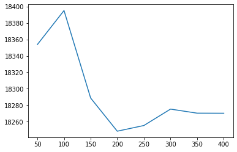

**This notebook is an exercise in the [Intermediate Machine Learning](https://www.kaggle.com/learn/intermediate-machine-learning) course.  You can reference the tutorial at [this link](https://www.kaggle.com/alexisbcook/cross-validation).**

---


In this exercise, you will leverage what you've learned to tune a machine learning model with **cross-validation**.

# Setup

The questions below will give you feedback on your work. Run the following cell to set up the feedback system.


```python
# Set up code checking
import os
if not os.path.exists("../input/train.csv"):
    os.symlink("../input/home-data-for-ml-course/train.csv", "../input/train.csv")  
    os.symlink("../input/home-data-for-ml-course/test.csv", "../input/test.csv") 
from learntools.core import binder
binder.bind(globals())
from learntools.ml_intermediate.ex5 import *
print("Setup Complete")
```

    Setup Complete


You will work with the [Housing Prices Competition for Kaggle Learn Users](https://www.kaggle.com/c/home-data-for-ml-course) from the previous exercise. 


Run the next code cell without changes to load the training and test data in `X` and `X_test`.  For simplicity, we drop categorical variables.


```python
import pandas as pd
from sklearn.model_selection import train_test_split

# Read the data
train_data = pd.read_csv('../input/train.csv', index_col='Id')
test_data = pd.read_csv('../input/test.csv', index_col='Id')

# Remove rows with missing target, separate target from predictors
train_data.dropna(axis=0, subset=['SalePrice'], inplace=True)
y = train_data.SalePrice              
train_data.drop(['SalePrice'], axis=1, inplace=True)

# Select numeric columns only
numeric_cols = [cname for cname in train_data.columns if train_data[cname].dtype in ['int64', 'float64']]
X = train_data[numeric_cols].copy()
X_test = test_data[numeric_cols].copy()
```

Use the next code cell to print the first several rows of the data.


```python
X.head()
```


<div>
<style scoped>
    .dataframe tbody tr th:only-of-type {
        vertical-align: middle;
    }

    .dataframe tbody tr th {
        vertical-align: top;
    }

    .dataframe thead th {
        text-align: right;
    }
</style>
<table border="1" class="dataframe">
  <thead>
    <tr style="text-align: right;">
      <th></th>
      <th>MSSubClass</th>
      <th>LotFrontage</th>
      <th>LotArea</th>
      <th>OverallQual</th>
      <th>OverallCond</th>
      <th>YearBuilt</th>
      <th>YearRemodAdd</th>
      <th>MasVnrArea</th>
      <th>BsmtFinSF1</th>
      <th>BsmtFinSF2</th>
      <th>...</th>
      <th>GarageArea</th>
      <th>WoodDeckSF</th>
      <th>OpenPorchSF</th>
      <th>EnclosedPorch</th>
      <th>3SsnPorch</th>
      <th>ScreenPorch</th>
      <th>PoolArea</th>
      <th>MiscVal</th>
      <th>MoSold</th>
      <th>YrSold</th>
    </tr>
    <tr>
      <th>Id</th>
      <th></th>
      <th></th>
      <th></th>
      <th></th>
      <th></th>
      <th></th>
      <th></th>
      <th></th>
      <th></th>
      <th></th>
      <th></th>
      <th></th>
      <th></th>
      <th></th>
      <th></th>
      <th></th>
      <th></th>
      <th></th>
      <th></th>
      <th></th>
      <th></th>
    </tr>
  </thead>
  <tbody>
    <tr>
      <th>1</th>
      <td>60</td>
      <td>65.0</td>
      <td>8450</td>
      <td>7</td>
      <td>5</td>
      <td>2003</td>
      <td>2003</td>
      <td>196.0</td>
      <td>706</td>
      <td>0</td>
      <td>...</td>
      <td>548</td>
      <td>0</td>
      <td>61</td>
      <td>0</td>
      <td>0</td>
      <td>0</td>
      <td>0</td>
      <td>0</td>
      <td>2</td>
      <td>2008</td>
    </tr>
    <tr>
      <th>2</th>
      <td>20</td>
      <td>80.0</td>
      <td>9600</td>
      <td>6</td>
      <td>8</td>
      <td>1976</td>
      <td>1976</td>
      <td>0.0</td>
      <td>978</td>
      <td>0</td>
      <td>...</td>
      <td>460</td>
      <td>298</td>
      <td>0</td>
      <td>0</td>
      <td>0</td>
      <td>0</td>
      <td>0</td>
      <td>0</td>
      <td>5</td>
      <td>2007</td>
    </tr>
    <tr>
      <th>3</th>
      <td>60</td>
      <td>68.0</td>
      <td>11250</td>
      <td>7</td>
      <td>5</td>
      <td>2001</td>
      <td>2002</td>
      <td>162.0</td>
      <td>486</td>
      <td>0</td>
      <td>...</td>
      <td>608</td>
      <td>0</td>
      <td>42</td>
      <td>0</td>
      <td>0</td>
      <td>0</td>
      <td>0</td>
      <td>0</td>
      <td>9</td>
      <td>2008</td>
    </tr>
    <tr>
      <th>4</th>
      <td>70</td>
      <td>60.0</td>
      <td>9550</td>
      <td>7</td>
      <td>5</td>
      <td>1915</td>
      <td>1970</td>
      <td>0.0</td>
      <td>216</td>
      <td>0</td>
      <td>...</td>
      <td>642</td>
      <td>0</td>
      <td>35</td>
      <td>272</td>
      <td>0</td>
      <td>0</td>
      <td>0</td>
      <td>0</td>
      <td>2</td>
      <td>2006</td>
    </tr>
    <tr>
      <th>5</th>
      <td>60</td>
      <td>84.0</td>
      <td>14260</td>
      <td>8</td>
      <td>5</td>
      <td>2000</td>
      <td>2000</td>
      <td>350.0</td>
      <td>655</td>
      <td>0</td>
      <td>...</td>
      <td>836</td>
      <td>192</td>
      <td>84</td>
      <td>0</td>
      <td>0</td>
      <td>0</td>
      <td>0</td>
      <td>0</td>
      <td>12</td>
      <td>2008</td>
    </tr>
  </tbody>
</table>
<p>5 rows × 36 columns</p>
</div>


```python
X.info()
```

    <class 'pandas.core.frame.DataFrame'>
    Int64Index: 1460 entries, 1 to 1460
    Data columns (total 36 columns):
     #   Column         Non-Null Count  Dtype  
    ---  ------         --------------  -----  
     0   MSSubClass     1460 non-null   int64  
     1   LotFrontage    1201 non-null   float64
     2   LotArea        1460 non-null   int64  
     3   OverallQual    1460 non-null   int64  
     4   OverallCond    1460 non-null   int64  
     5   YearBuilt      1460 non-null   int64  
     6   YearRemodAdd   1460 non-null   int64  
     7   MasVnrArea     1452 non-null   float64
     8   BsmtFinSF1     1460 non-null   int64  
     9   BsmtFinSF2     1460 non-null   int64  
     10  BsmtUnfSF      1460 non-null   int64  
     11  TotalBsmtSF    1460 non-null   int64  
     12  1stFlrSF       1460 non-null   int64  
     13  2ndFlrSF       1460 non-null   int64  
     14  LowQualFinSF   1460 non-null   int64  
     15  GrLivArea      1460 non-null   int64  
     16  BsmtFullBath   1460 non-null   int64  
     17  BsmtHalfBath   1460 non-null   int64  
     18  FullBath       1460 non-null   int64  
     19  HalfBath       1460 non-null   int64  
     20  BedroomAbvGr   1460 non-null   int64  
     21  KitchenAbvGr   1460 non-null   int64  
     22  TotRmsAbvGrd   1460 non-null   int64  
     23  Fireplaces     1460 non-null   int64  
     24  GarageYrBlt    1379 non-null   float64
     25  GarageCars     1460 non-null   int64  
     26  GarageArea     1460 non-null   int64  
     27  WoodDeckSF     1460 non-null   int64  
     28  OpenPorchSF    1460 non-null   int64  
     29  EnclosedPorch  1460 non-null   int64  
     30  3SsnPorch      1460 non-null   int64  
     31  ScreenPorch    1460 non-null   int64  
     32  PoolArea       1460 non-null   int64  
     33  MiscVal        1460 non-null   int64  
     34  MoSold         1460 non-null   int64  
     35  YrSold         1460 non-null   int64  
    dtypes: float64(3), int64(33)
    memory usage: 422.0 KB


So far, you've learned how to build pipelines with scikit-learn.  For instance, the pipeline below will use [`SimpleImputer()`](https://scikit-learn.org/stable/modules/generated/sklearn.impute.SimpleImputer.html) to replace missing values in the data, before using [`RandomForestRegressor()`](https://scikit-learn.org/stable/modules/generated/sklearn.ensemble.RandomForestRegressor.html) to train a random forest model to make predictions.  We set the number of trees in the random forest model with the `n_estimators` parameter, and setting `random_state` ensures reproducibility.


```python
from sklearn.ensemble import RandomForestRegressor
from sklearn.pipeline import Pipeline
from sklearn.impute import SimpleImputer

my_pipeline = Pipeline(steps=[
    ('preprocessor', SimpleImputer()),
    ('model', RandomForestRegressor(n_estimators=50, random_state=0))
])
```

You have also learned how to use pipelines in cross-validation.  The code below uses the [`cross_val_score()`](https://scikit-learn.org/stable/modules/generated/sklearn.model_selection.cross_val_score.html) function to obtain the mean absolute error (MAE), averaged across five different folds.  Recall we set the number of folds with the `cv` parameter.


```python
from sklearn.model_selection import cross_val_score

# Multiply by -1 since sklearn calculates *negative* MAE
scores = -1 * cross_val_score(my_pipeline, X, y,
                              cv=5,
                              scoring='neg_mean_absolute_error')

print("Average MAE score:", scores.mean())
```

    Average MAE score: 18276.410356164386


```python
scores
```


    array([18549.88568493, 17896.67034247, 18462.68472603, 16587.02472603,
           19885.78630137])


# Step 1: Write a useful function

In this exercise, you'll use cross-validation to select parameters for a machine learning model.

Begin by writing a function `get_score()` that reports the average (over three cross-validation folds) MAE of a machine learning pipeline that uses:
- the data in `X` and `y` to create folds,
- `SimpleImputer()` (with all parameters left as default) to replace missing values, and
- `RandomForestRegressor()` (with `random_state=0`) to fit a random forest model.

The `n_estimators` parameter supplied to `get_score()` is used when setting the number of trees in the random forest model.  


```python
def get_score(n_estimators):
    """Return the average MAE over 3 CV folds of random forest model.
    
    Keyword argument:
    n_estimators -- the number of trees in the forest
    """
    # Replace this body with your own code
    my_pipeline = Pipeline(steps=[
        ('preprocessor', SimpleImputer()),
        ('model', RandomForestRegressor(n_estimators, random_state=0))
    ])
    scores = -1 * cross_val_score(my_pipeline, X, y,
                              cv=3,
                              scoring='neg_mean_absolute_error')
    return scores.mean()
    

# Check your answer
step_1.check()
```


    <IPython.core.display.Javascript object>


<span style="color:#33cc33">Correct</span>


```python
# Lines below will give you a hint or solution code
#step_1.hint()
#step_1.solution()
```

# Step 2: Test different parameter values

Now, you will use the function that you defined in Step 1 to evaluate the model performance corresponding to eight different values for the number of trees in the random forest: 50, 100, 150, ..., 300, 350, 400.

Store your results in a Python dictionary `results`, where `results[i]` is the average MAE returned by `get_score(i)`.


```python
results = {n_estimators : get_score(n_estimators) for n_estimators in range(50, 401, 50)}
    
results
```


    {50: 18353.8393511688,
     100: 18395.2151680032,
     150: 18288.730020956387,
     200: 18248.345889801505,
     250: 18255.26922247291,
     300: 18275.241922621914,
     350: 18270.29183308043,
     400: 18270.197974402367}


```python
results = {n_estimators : get_score(n_estimators) for n_estimators in range(50, 401, 50)}

# Check your answer
step_2.check()
```


    <IPython.core.display.Javascript object>


<span style="color:#33cc33">Correct</span>


```python
# Lines below will give you a hint or solution code
#step_2.hint()
#step_2.solution()
```

Use the next cell to visualize your results from Step 2.  Run the code without changes.


```python
import matplotlib.pyplot as plt
%matplotlib inline

plt.plot(list(results.keys()), list(results.values()))
plt.show()
```


    

    


# Step 3: Find the best parameter value

Given the results, which value for `n_estimators` seems best for the random forest model?  Use your answer to set the value of `n_estimators_best`.


```python
n_estimators_best = 200

# Check your answer
step_3.check()
```


    <IPython.core.display.Javascript object>


<span style="color:#33cc33">Correct</span>


```python
# Lines below will give you a hint or solution code
#step_3.hint()
#step_3.solution()
```

In this exercise, you have explored one method for choosing appropriate parameters in a machine learning model.  

If you'd like to learn more about [hyperparameter optimization](https://en.wikipedia.org/wiki/Hyperparameter_optimization), you're encouraged to start with **grid search**, which is a straightforward method for determining the best _combination_ of parameters for a machine learning model.  Thankfully, scikit-learn also contains a built-in function [`GridSearchCV()`](https://scikit-learn.org/stable/modules/generated/sklearn.model_selection.GridSearchCV.html) that can make your grid search code very efficient!

# Keep going

Continue to learn about **[gradient boosting](https://www.kaggle.com/alexisbcook/xgboost)**, a powerful technique that achieves state-of-the-art results on a variety of datasets.

---


*Have questions or comments? Visit the [course discussion forum](https://www.kaggle.com/learn/intermediate-machine-learning/discussion) to chat with other learners.*




