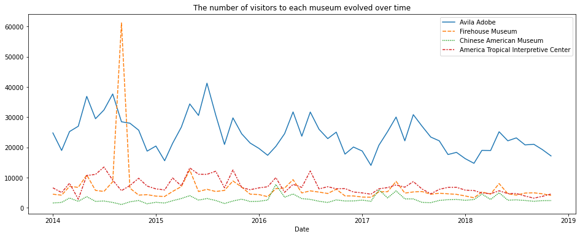
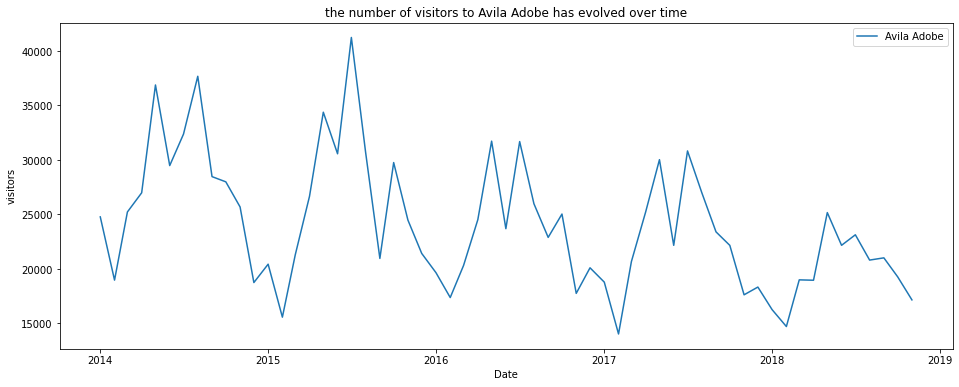

**This notebook is an exercise in the [Data Visualization](https://www.kaggle.com/learn/data-visualization) course.  You can reference the tutorial at [this link](https://www.kaggle.com/alexisbcook/line-charts).**

---


In this exercise, you will use your new knowledge to propose a solution to a real-world scenario. To succeed, you will need to import data into Python, answer questions using the data, and generate **line charts** to understand patterns in the data.

## Scenario

You have recently been hired to manage the museums in the City of Los Angeles. Your first project focuses on the four museums pictured in the images below.


You will leverage data from the Los Angeles [Data Portal](https://data.lacity.org/) that tracks monthly visitors to each museum.  


## Setup

Run the next cell to import and configure the Python libraries that you need to complete the exercise.


```python
import pandas as pd
pd.plotting.register_matplotlib_converters()
import matplotlib.pyplot as plt
%matplotlib inline
import seaborn as sns
print("Setup Complete")
```

    Setup Complete


The questions below will give you feedback on your work. Run the following cell to set up the feedback system.


```python
# Set up code checking
import os
if not os.path.exists("../input/museum_visitors.csv"):
    os.symlink("../input/data-for-datavis/museum_visitors.csv", "../input/museum_visitors.csv") 
from learntools.core import binder
binder.bind(globals())
from learntools.data_viz_to_coder.ex2 import *
print("Setup Complete")
```

    Setup Complete


## Step 1: Load the data

Your first assignment is to read the LA Museum Visitors data file into `museum_data`.  Note that:
- The filepath to the dataset is stored as `museum_filepath`.  Please **do not** change the provided value of the filepath.
- The name of the column to use as row labels is `"Date"`.  (This can be seen in cell A1 when the file is opened in Excel.)

To help with this, you may find it useful to revisit some relevant code from the tutorial, which we have pasted below:

```python
# Path of the file to read
spotify_filepath = "../input/spotify.csv"

# Read the file into a variable spotify_data
spotify_data = pd.read_csv(spotify_filepath, index_col="Date", parse_dates=True)
```

The code you need to write now looks very similar!


```python
# Path of the file to read
museum_filepath = "../input/museum_visitors.csv"

# Fill in the line below to read the file into a variable museum_data
museum_data = pd.read_csv(museum_filepath, index_col="Date", parse_dates=True)

# Run the line below with no changes to check that you've loaded the data correctly
step_1.check()
```


    <IPython.core.display.Javascript object>


<span style="color:#33cc33">Correct</span>


```python
# Uncomment the line below to receive a hint
#step_1.hint()
# Uncomment the line below to see the solution
#step_1.solution()
```

## Step 2: Review the data

Use a Python command to print the last 5 rows of the data.


```python
# Print the last five rows of the data 
museum_data.tail()
```


<div>
<style scoped>
    .dataframe tbody tr th:only-of-type {
        vertical-align: middle;
    }

    .dataframe tbody tr th {
        vertical-align: top;
    }

    .dataframe thead th {
        text-align: right;
    }
</style>
<table border="1" class="dataframe">
  <thead>
    <tr style="text-align: right;">
      <th></th>
      <th>Avila Adobe</th>
      <th>Firehouse Museum</th>
      <th>Chinese American Museum</th>
      <th>America Tropical Interpretive Center</th>
    </tr>
    <tr>
      <th>Date</th>
      <th></th>
      <th></th>
      <th></th>
      <th></th>
    </tr>
  </thead>
  <tbody>
    <tr>
      <th>2018-07-01</th>
      <td>23136</td>
      <td>4191</td>
      <td>2620</td>
      <td>4718</td>
    </tr>
    <tr>
      <th>2018-08-01</th>
      <td>20815</td>
      <td>4866</td>
      <td>2409</td>
      <td>3891</td>
    </tr>
    <tr>
      <th>2018-09-01</th>
      <td>21020</td>
      <td>4956</td>
      <td>2146</td>
      <td>3180</td>
    </tr>
    <tr>
      <th>2018-10-01</th>
      <td>19280</td>
      <td>4622</td>
      <td>2364</td>
      <td>3775</td>
    </tr>
    <tr>
      <th>2018-11-01</th>
      <td>17163</td>
      <td>4082</td>
      <td>2385</td>
      <td>4562</td>
    </tr>
  </tbody>
</table>
</div>


The last row (for `2018-11-01`) tracks the number of visitors to each museum in November 2018, the next-to-last row (for `2018-10-01`) tracks the number of visitors to each museum in October 2018, _and so on_.

Use the last 5 rows of the data to answer the questions below.


```python
# Fill in the line below: How many visitors did the Chinese American Museum 
# receive in July 2018?
ca_museum_jul18 = 2620 

# Fill in the line below: In October 2018, how many more visitors did Avila 
# Adobe receive than the Firehouse Museum?
avila_oct18 = 19280 - 4622

# Check your answers
step_2.check()
```


    <IPython.core.display.Javascript object>


<span style="color:#33cc33">Correct</span>


```python
# Lines below will give you a hint or solution code
#step_2.hint()
#step_2.solution()
```

## Step 3: Convince the museum board 

The Firehouse Museum claims they ran an event in 2014 that brought an incredible number of visitors, and that they should get extra budget to run a similar event again.  The other museums think these types of events aren't that important, and budgets should be split purely based on recent visitors on an average day.  

To show the museum board how the event compared to regular traffic at each museum, create a line chart that shows how the number of visitors to each museum evolved over time.  Your figure should have four lines (one for each museum).

> **(Optional) Note**: If you have some prior experience with plotting figures in Python, you might be familiar with the `plt.show()` command.  If you decide to use this command, please place it **after** the line of code that checks your answer (in this case, place it after `step_3.check()` below) -- otherwise, the checking code will return an error!


```python
# Line chart showing the number of visitors to each museum over time
# Set the width and height of the figure
plt.figure(figsize=(16, 6))

# Add title
plt.title("The number of visitors to each museum evolved over time")

# Line chart showing the number of visitors
sns.lineplot(data=museum_data)

# Check your answer
step_3.check()

# plotting
plt.show()
```


    <IPython.core.display.Javascript object>


<span style="color:#33cc33">Correct</span>


    

    


```python
# Lines below will give you a hint or solution code
#step_3.hint()
#step_3.solution_plot()
```

## Step 4: Assess seasonality

When meeting with the employees at Avila Adobe, you hear that one major pain point is that the number of museum visitors varies greatly with the seasons, with low seasons (when the employees are perfectly staffed and happy) and also high seasons (when the employees are understaffed and stressed).  You realize that if you can predict these high and low seasons, you can plan ahead to hire some additional seasonal employees to help out with the extra work.

#### Part A
Create a line chart that shows how the number of visitors to Avila Adobe has evolved over time.  (_If your code returns an error, the first thing that you should check is that you've spelled the name of the column correctly!  You must write the name of the column exactly as it appears in the dataset._)


```python
# Line plot showing the number of visitors to Avila Adobe over time
# Set the width and height of the figure
plt.figure(figsize=(16, 6))

# Add title
plt.title("the number of visitors to Avila Adobe has evolved over time")

# Line chart showing the number of visitors to Avila Adobe
sns.lineplot(data=museum_data['Avila Adobe'], label="Avila Adobe")

# Add label for horizontal axis
plt.xlabel("Date")
plt.ylabel("visitors")

# Check your answer
step_4.a.check()

# plotting
plt.show()
```

    Thank you for creating a line chart!  To see how your code compares to the official solution, please use the code cell below.


    <IPython.core.display.Javascript object>


<span style="color:#33cc33">Correct</span>


    

    


```python
# Lines below will give you a hint or solution code
#step_4.a.hint()
# step_4.a.solution_plot()
```

#### Part B

Does Avila Adobe get more visitors:
- in September-February (in LA, the fall and winter months), or 
- in March-August (in LA, the spring and summer)?  

Using this information, when should the museum staff additional seasonal employees?


```python
step_4.b.hint()
```


    <IPython.core.display.Javascript object>


<span style="color:#3366cc">Hint:</span> Look at the early part of each year (around January).  Does the line chart dip to low values or reach relatively high values?


```python
# Check your answer (Run this code cell to receive credit!)
step_4.b.solution()
```


    <IPython.core.display.Javascript object>


<span style="color:#33cc99">Solution:</span> The line chart generally dips to relatively low values around the early part of each year (in December and January), and reaches its highest values in the middle of the year (especially around May and June).  Thus, Avila Adobe usually gets more visitors in March-August (or the spring and summer months).  With this in mind, Avila Adobe could definitely benefit from hiring more seasonal employees to help with the extra work in March-August (the spring and summer)!


# Keep going

Move on to learn about **[bar charts and heatmaps](https://www.kaggle.com/alexisbcook/bar-charts-and-heatmaps)** with a new dataset!

---


*Have questions or comments? Visit the [course discussion forum](https://www.kaggle.com/learn/data-visualization/discussion) to chat with other learners.*
